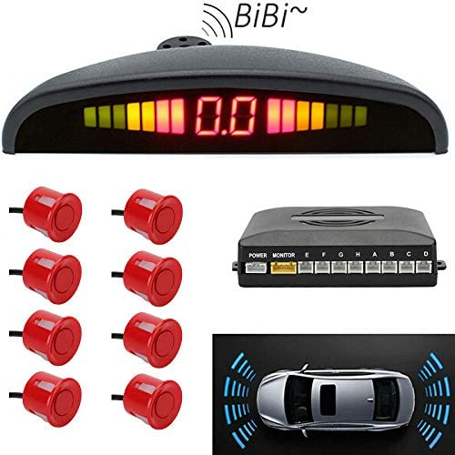

# Car Parking  with Arduino

Based on this code :

https://forum.arduino.cc/index.php?topic=175764.msg3543184#msg3543184

but with another protocol to use this box :

https://www.amazon.fr/gp/product/B00X9UCN8K/ref=ppx_yo_dt_b_asin_title_o00_s00?ie=UTF8&psc=1

